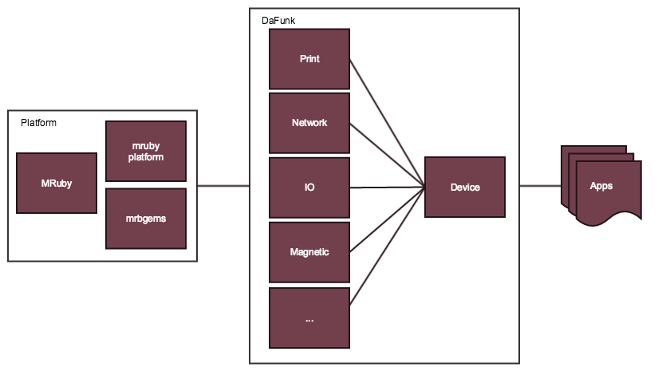

# Around The World

MRuby for non embedded platforms to be compliance with DaFunk API.

# Map




## Setup

1. Install Ruby
2. Install cloudwalk cli, check [here](http://cli.cloudwalk.io)
3. Setup submodules `rake setup`
4. Create build.rb, see [Docs](https://github.com/mruby/mruby/tree/1.0.0/doc/compile), [Sample Cross Compilation](https://github.com/cloudwalkio/around_the_world/blob/master/build.rb) and [Sample MRuby](https://github.com/mruby/mruby/blob/1.0.0/build_config.rb)
5. Build `CONFIG=build.rb rake`


## Main

Follow Main sample to start the MRuby runtime

```c
#include <stdint.h>
#include <stdlib.h>
#include <stdio.h>
#include <string.h>

/* Include the mruby header */
#include "mruby.h"
#include "mruby/value.h"
#include "mruby/compile.h"
#include "mruby/proc.h"

int main(int argc, char **argv)
{
  mrb_state *mrb;
  mrbc_context *c;
  char code[] = "puts \"Hello World\"";

  mrb = mrb_open();
  c   = mrbc_context_new(mrb);

  mrb_load_string_cxt(mrb, code, c);
  mrbc_context_free(mrb, c);

  mrb_close(mrb);

  return 0;
}
```

## Contributing

1. Fork it
2. Create your feature branch (`git checkout -b my-new-feature`)
3. Commit your changes (`git commit -am 'Added some feature'`)
4. Push to the branch (`git push origin my-new-feature`)
5. Create new Pull Request